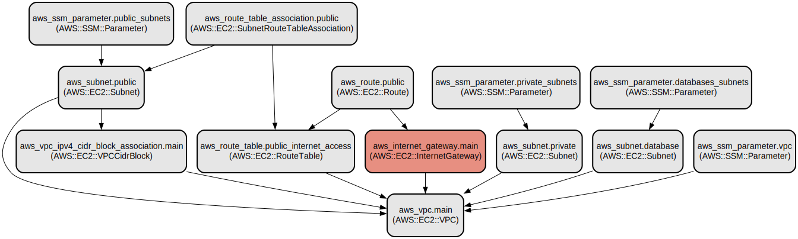

# AWS VPC Infrastructure as Code with Terraform

This project provides a robust and scalable AWS VPC infrastructure setup using Terraform. It creates a fully configured Virtual Private Cloud (VPC) with public, private, and database subnets across multiple availability zones, complete with proper networking components and security configurations.

The infrastructure is designed to support multi-tier applications with clear network segregation between public-facing components, private application layers, and database resources. It implements AWS best practices for network design and security, including proper subnet isolation, NAT Gateways for private subnet internet access, and network ACLs for database subnet protection. All infrastructure components are managed through AWS Systems Manager Parameter Store for easy reference and integration with other AWS services.

## Repository Structure
```
.
├── backend.tf              # S3 backend configuration for Terraform state
├── databases_subnet.tf     # Database subnet configuration with network ACLs
├── internet_gateway.tf     # Internet Gateway configuration for public access
├── output.tf              # Output definitions for VPC and subnet IDs
├── parameters_store.tf     # AWS Systems Manager Parameter Store configurations
├── private_subnets.tf     # Private subnet and NAT Gateway configurations
├── providers.tf           # AWS provider configuration
├── public_subnets.tf      # Public subnet and routing configurations
├── variables.tf           # Input variable definitions
└── vpc.tf                 # Main VPC resource configuration
```

## Usage Instructions
### Prerequisites
- AWS CLI installed and configured with appropriate credentials
- Terraform v0.12.0 or later
- An AWS account with necessary permissions to create VPC resources
- S3 bucket for Terraform state storage (referenced in backend.tf)

### Installation
1. Clone the repository:
```bash
git clone <repository-url>
cd <repository-name>
```

2. Initialize Terraform:
```bash
terraform init
```

3. Review and modify variables:
```bash
cp terraform.tfvars.example terraform.tfvars
# Edit terraform.tfvars with your desired values
```

### Quick Start
1. Review the infrastructure plan:
```bash
terraform plan
```

2. Apply the infrastructure:
```bash
terraform apply
```

3. Confirm the changes when prompted by typing `yes`

### More Detailed Examples
1. Creating a VPC with custom CIDR:
```hcl
module "vpc" {
  source = "./"
  
  project_name = "my-project"
  vpc_cidr = "10.0.0.0/16"
  region = "us-west-2"
  
  public_subnets = [
    {
      name = "public-1a"
      cidr = "10.0.1.0/24"
      availability_zone = "us-west-2a"
    }
  ]
  # Add private and database subnet configurations as needed
}
```

### Troubleshooting
Common issues and solutions:

1. **Subnet CIDR Conflicts**
   - Error: "The CIDR block conflicts with another subnet"
   - Solution: Ensure all subnet CIDR blocks are unique and within the VPC CIDR range
   - Debug: Review the `vpc_cidr` and subnet CIDR configurations in your tfvars file

2. **NAT Gateway Creation Failure**
   - Error: "Error creating NAT Gateway"
   - Solution: Verify that you have available Elastic IP addresses and proper internet gateway attachment
   - Debug: Check the VPC's internet gateway status and EIP allocation limits

## Data Flow
The infrastructure creates a hierarchical network structure with controlled data flow between different subnet tiers.

```ascii
Internet
    ↓
Internet Gateway
    ↓
Public Subnets (NAT Gateway, Load Balancers)
    ↓
Private Subnets (Application Servers)
    ↓
Database Subnets (RDS, ElastiCache)
```

Key component interactions:
1. Internet Gateway provides internet access to public subnets
2. NAT Gateways in public subnets enable outbound internet access for private subnets
3. Private subnets host application servers with no direct internet access
4. Database subnets are isolated with network ACLs allowing only specific ports
5. All subnet IDs and VPC information are stored in Parameter Store for easy reference

## Infrastructure


The infrastructure includes the following AWS resources:

### VPC Resources
- VPC with DNS support and hostnames enabled
- Internet Gateway for public internet access
- Additional CIDR block associations as specified

### Subnet Resources
- Public subnets with internet access via Internet Gateway
- Private subnets with outbound internet access via NAT Gateways
- Database subnets with restricted access via Network ACLs

### Networking Components
- NAT Gateways with Elastic IPs for private subnet internet access
- Route tables for public and private subnets
- Network ACLs for database subnets (MySQL and Redis ports)

### Parameter Store
- VPC ID parameter
- Public subnet ID parameters
- Private subnet ID parameters
- Database subnet ID parameters